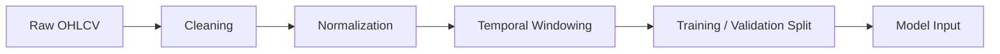
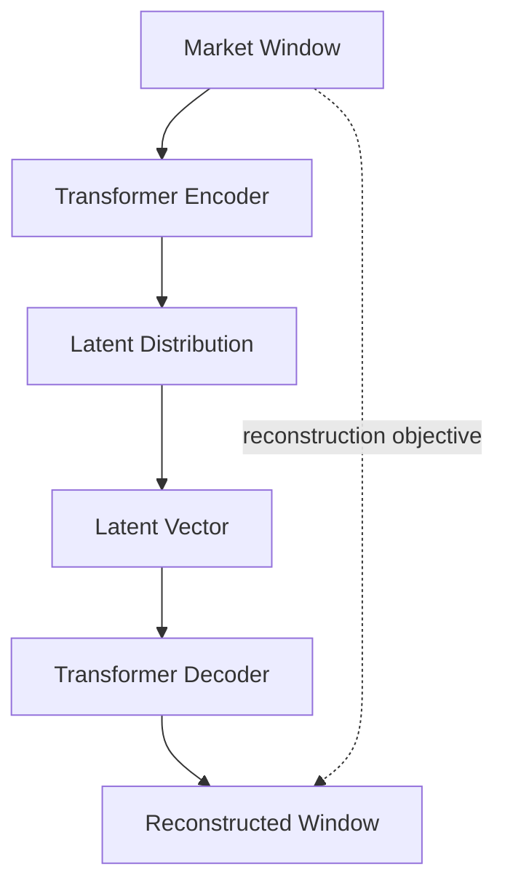
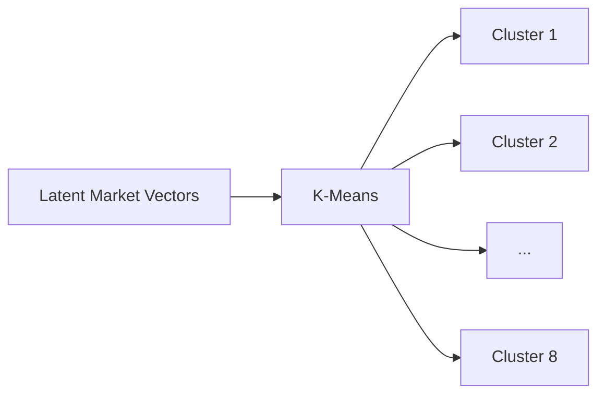
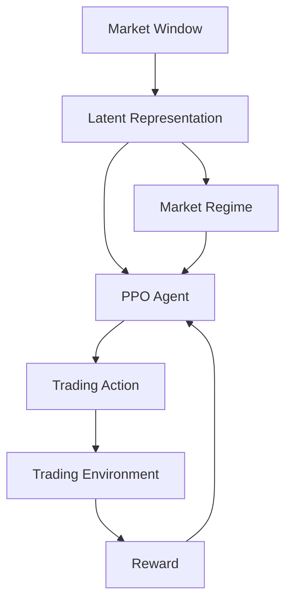
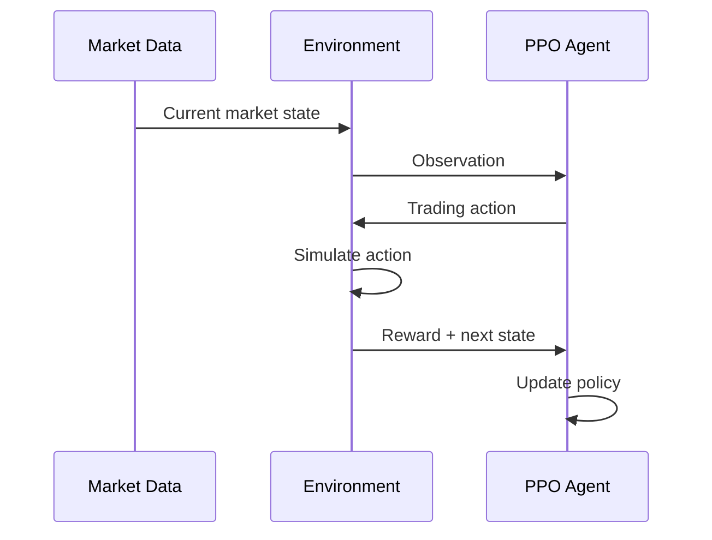
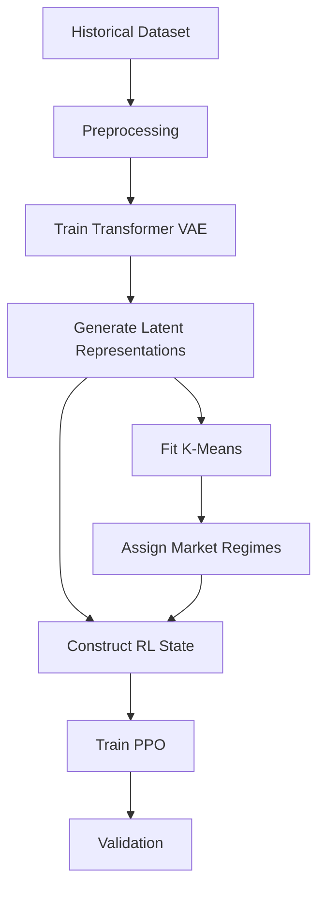

# TradeVisor AI

> **AI-Based Algorithmic Trading Research System**

## Overview

**TradeVisor AI** is an experimental artificial-intelligence system designed to investigate adaptive decision-making for financial markets.

The project combines **deep representation learning, unsupervised market-regime discovery, and reinforcement learning** into a single research pipeline. Rather than relying exclusively on manually designed technical-analysis rules, the system attempts to learn useful representations of market behavior and use those representations to make adaptive trading decisions.

The project was primarily designed around **foreign-exchange (Forex) OHLCV time-series data** at the M15 timeframe.

> **Repository Notice:**  
> This repository contains architectural and technical documentation only. The original implementation, private experiments, datasets, trading credentials, broker configuration, and proprietary source code are not publicly distributed.

---

## Project Objectives

The main objectives of TradeVisor AI are:

- Learn meaningful representations of financial time-series data.
- Compress high-dimensional market windows into useful latent representations.
- Discover recurring market regimes automatically.
- Incorporate market-regime information into an adaptive trading policy.
- Investigate reinforcement learning for trading decisions.
- Evaluate the resulting strategy using quantitative performance metrics.
- Build an architecture that can be extended with additional assets, features, and learning methods.

---

# System Architecture

The overall system can be represented as a multi-stage machine-learning pipeline:

```mermaid
flowchart LR
    A[Historical OHLCV Data]
    B[Preprocessing & Windowing]
    C[Transformer VAE]
    D[Latent Market Representation]
    E[K-Means Regime Detection]
    F[Market Regime]
    G[PPO Trading Agent]
    H[Trading Decisions]
    I[Backtesting Environment]
    J[Performance Evaluation]

    A --> B
    B --> C
    C --> D
    D --> E
    E --> F
    D --> G
    F --> G
    G --> H
    H --> I
    I --> J
```



The architecture can be divided into four major stages:

1. **Market Data Processing**
2. **Representation Learning**
3. **Market Regime Discovery**
4. **Reinforcement-Learning-Based Decision Making**

---

# 1. Market Data

The system works with historical OHLCV market data.

The main market variables are:

- Open
- High
- Low
- Close
- Volume

The original experiments used multiple Forex pairs, including:

- EUR/USD
- GBP/USD
- USD/CAD
- USD/JPY

The data is transformed into fixed-length temporal windows before being passed to the neural architecture.

---

# 2. Data Preprocessing

Raw market data is not directly provided to the learning system.

The preprocessing stage prepares the data for temporal modeling.

Conceptually:



## Temporal Windowing

Instead of treating each candle as an independent observation, TradeVisor AI groups consecutive observations into temporal windows.

A window therefore represents a short historical sequence:

```text
t-59 → t-58 → ... → t-2 → t-1 → t
```

This allows the model to learn relationships between different points in time.

The experiments used windows containing **60 time steps**.

---

# 3. Transformer-Based Representation Learning

The central representation-learning component is a **Transformer Variational Autoencoder (VAE)**.

Its purpose is not directly to predict whether the next trade will be profitable.

Instead, it learns a compressed representation of the market.



The architecture therefore has two conceptual paths:

### Encoding

The Transformer encoder processes the temporal market window and extracts higher-level features.

### Latent Representation

The VAE converts the encoded information into a compact latent representation.

### Decoding

The decoder attempts to reconstruct the original market window from the latent representation.

The reconstruction objective encourages the latent space to preserve important information about market behavior.

---

# 4. Latent Market Representation

One of the important ideas behind TradeVisor AI is that raw OHLCV values may not be the most useful representation for a decision-making agent.

Instead, the system attempts to transform a market window into a compact latent vector.

Conceptually:

```text
60-step market window
        ↓
Transformer VAE
        ↓
Latent representation
        ↓
Compact representation of market state
```

The experiments used a **16-dimensional latent representation**.

This representation can then be used by subsequent components of the system.

---

# 5. Market Regime Detection

Once latent representations have been generated, TradeVisor AI uses **K-Means clustering** to discover recurring groups of market states.

The system used **8 clusters/regimes** in the experiments.



Each cluster represents a statistically similar region of the learned latent space.

These clusters can be interpreted as learned **market regimes**.

For example, a regime may correspond to market behavior characterized by some combination of:

- Strong directional movement
- Weak directional movement
- High volatility
- Low volatility
- Transitional behavior

However, the model does **not inherently assign semantic names** such as "bull market" or "bear market." The clusters are learned from the data.

---

# 6. Reinforcement Learning

The next major component is a **Proximal Policy Optimization (PPO)** agent.

The objective is to investigate whether an RL policy can use the learned market representation and regime information to make trading decisions.



The agent interacts with a simulated trading environment.

At each step, it receives information describing the current market state and chooses an action according to its learned policy.

---

# 7. Trading Environment

The reinforcement-learning environment represents the trading process.

Conceptually, the environment contains:

```text
Market State
      +
Latent Representation
      +
Market Regime
      +
Trading / Portfolio State
      ↓
     PPO
      ↓
    Action
      ↓
Trading Environment
      ↓
    Reward
```

Depending on the experimental configuration, actions can represent different trading decisions such as:

- Entering a position
- Maintaining a position
- Exiting a position
- Choosing a directional position

The exact action space and reward formulation are experimental components of the research system.

---

# 8. Reward and Learning Loop

The PPO agent learns through repeated interaction with the simulated environment.

A simplified learning cycle is:



The agent attempts to maximize cumulative reward rather than simply maximizing the percentage of winning trades.

This distinction is important because a strategy can have a high win rate while still producing poor overall returns if losses are significantly larger than wins.

---

# 9. Training Architecture

The training process can be separated into stages.



This separation allows each component to be evaluated independently.

---

# 10. Validation

The dataset was divided into training and validation portions.

The purpose of validation is to evaluate whether the learned behavior generalizes to market observations that were not used during training.

This is particularly important in financial machine learning because financial time series are highly non-stationary and can contain substantial noise.

A strong training result does not automatically imply that the strategy will generalize to unseen market conditions.

---

# 11. Performance Evaluation

TradeVisor AI evaluates the resulting trading behavior using multiple metrics rather than relying on a single score.

Relevant metrics include:

### Win Rate

Measures the percentage of trades that close profitably.

### Equity Change

Measures the overall change in account equity over the evaluation period.

### Number of Trades

Provides context for the statistical significance of the results.

### Risk-Adjusted Metrics

Metrics such as the **Sortino ratio** can be used to evaluate returns relative to downside risk.

The project therefore considers both profitability and risk.

---

# 12. Research Results

During experimentation, the system reached substantially different results depending on the training configuration and evaluation stage.

One reported experimental configuration achieved approximately:

- **66.26% reported win rate**
- Approximately **+4.79% equity change**
- Approximately **30,800 trades**
- Approximately **4,000 winning trades**
- Approximately **2,000 losing trades**

These figures should be treated as **experimental results rather than evidence of a production-ready trading strategy**, particularly because different definitions and evaluation periods can produce different statistics.

The project also produced substantially lower validation performance in some experiments, demonstrating the difficulty of generalizing learned trading behavior.

---

# 13. Why the Architecture Uses Multiple Learning Methods

The architecture deliberately combines different machine-learning paradigms.

### Transformer

Used for modeling temporal dependencies.

### Variational Autoencoder

Used for learning a structured compressed representation.

### K-Means

Used for unsupervised discovery of market regimes.

### PPO

Used for adaptive sequential decision-making.

This creates a pipeline where each component addresses a different problem:

```text
Transformer
    ↓
Understand temporal structure

VAE
    ↓
Compress market information

K-Means
    ↓
Discover market regimes

PPO
    ↓
Learn decisions
```

---

# 14. Design Philosophy

The central design philosophy is:

> **Separate market representation from decision-making.**

Instead of asking a single model to directly map raw candles to trading actions, the architecture first attempts to construct a meaningful representation of the market.

That representation is then analyzed for recurring regimes and supplied to the decision-making system.

This makes the architecture more modular and allows individual components to be replaced or improved independently.

---

# 15. Potential Future Improvements

Possible future research directions include:

- Walk-forward validation
- More rigorous out-of-sample testing
- Transaction-cost modeling
- Spread and slippage simulation
- Position sizing
- Better reward functions
- Alternative regime-detection methods
- Transformer architecture optimization
- Alternative latent-space models
- Online regime adaptation
- Multi-timeframe representations
- Additional market features
- More robust risk management
- Comparison against strong non-AI baselines

---

# 16. Limitations

This project is a **research and experimentation project**, not a guaranteed profitable trading system.

Important limitations include:

- Financial markets are non-stationary.
- Historical performance does not guarantee future performance.
- Reinforcement learning can overfit its environment.
- High win rates do not necessarily imply profitability.
- Backtesting can differ significantly from live execution.
- Spread, slippage, latency, and transaction costs can materially affect results.
- Market-regime clusters do not necessarily correspond to economically meaningful regimes.
- Validation performance can differ substantially from training performance.

---

# 17. Technology Stack

| Category | Technologies / Methods |
|---|---|
| Language | Python |
| Data | OHLCV time-series |
| Deep Learning | Transformer, Variational Autoencoder |
| Unsupervised Learning | K-Means |
| Reinforcement Learning | PPO |
| Domain | Algorithmic Trading / Quantitative Finance |
| Evaluation | Backtesting, Win Rate, Equity, Sortino Ratio |

---

# 18. Key Concepts Demonstrated

This project demonstrates practical experimentation with:

- Deep learning
- Transformer architectures
- Representation learning
- Variational autoencoders
- Unsupervised learning
- Clustering
- Reinforcement learning
- Time-series modeling
- Quantitative finance
- Backtesting
- Model evaluation
- Modular ML architecture

---

## Disclaimer

This repository is intended for **educational and research documentation**.

Nothing in this project should be interpreted as financial advice or as a guarantee of trading profitability. Experimental backtesting results do not establish future performance.

The original implementation and private project assets are not included in this public repository.
